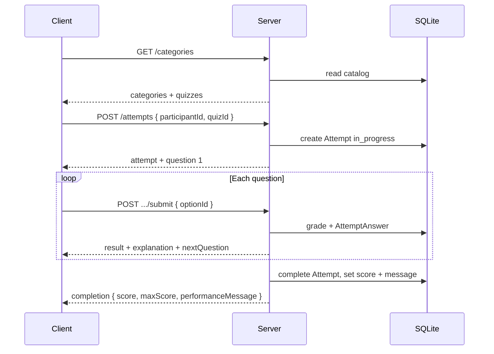
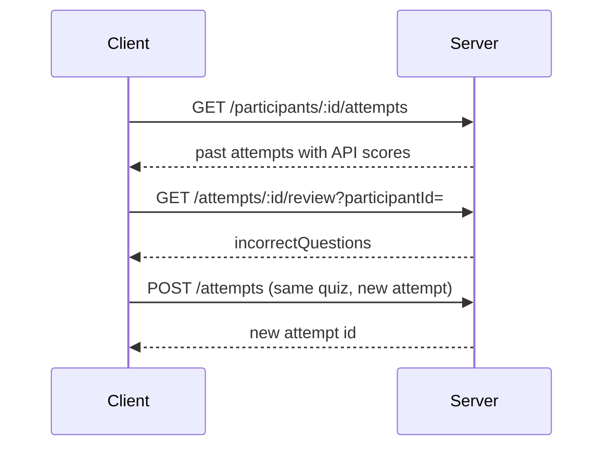

# QuizApp MVP — Plan

AI-educational quiz application. **Server-driven**: the API owns quiz state, grading, scoring, and what the client may see at each step. This document defines scope, rules, data model, and API before implementation.

---

## 1. Goals

| Goal | MVP behavior |
|------|----------------|
| Landing / categories | List quiz **categories** (AI development topics). Each category contains one or more **quizzes**. |
| Take a quiz | User picks a quiz; **5 multiple-choice questions** per quiz (fixed per quiz in seed data). |
| Per-question feedback | After submit: correct/incorrect, **explanation**, and points earned for that question (all from API). |
| Final results | **Final score** and **performance message** from API only. |
| Review | After completion, user can **review wrong answers** (via API fields returned for completed attempts). |
| History | **Attempt history** across browser sessions using a stable anonymous `participantId`. |
| Retake | **Unlimited retakes**; each run is a new attempt row. |

---

## 2. Non-negotiable rules

1. **Server computes all scores** — per-question points, running totals, and final score. The client displays numeric/text results exactly as returned; no recomputation, rounding overrides, or “pass/fail” logic in the UI.
2. **No answer leakage** — `GET` question payloads never include the correct option id, correctness flags, or explanations until the client **submits** that question (or fetches review on a **completed** attempt).
3. **Double-submit protection** — submitting the same question twice for the same attempt must be rejected (HTTP 409) or return the **same graded payload** idempotently (choose one strategy; see §6.3). Attempt status must prevent submitting after quiz is finished.
4. **Persistence** — all attempts and per-question answers stored in **SQLite** via **Prisma**.
5. **Phased delivery** — **Phase 1** server (schema, seed, catalog + attempt API, grading). **Phase 2** client landing. **Phase 3** quiz-taking UI + attempt persistence. **Phase 4** results, server score/percentage, session resume on refresh.

---

## 3. Assumptions (MVP)

- **No login** — identity is an anonymous `participantId` (UUID) created by the client and sent on attempt/history calls. Server does not verify ownership beyond “this attempt belongs to this participantId.”
- **English** copy for questions, explanations, and performance messages.
- **One correct option** per question; exactly **four options** per question (A–D style), stored as ordered options with stable ids.
- **Quiz length** — each quiz has exactly **5** questions in seed data (enforced in seed, validated in `POST /attempts` if quiz has ≠ 5 questions → 500/seed error in dev).
- **Ordering** — questions presented in fixed `sortOrder` (no randomization in MVP; can add server-side shuffle later).
- **Repo layout** — monorepo:

```
QuizApp/
  PLAN.md
  server/          # Phase 1
  client/          # Phase 2+ (landing, quiz, results)
  package.json     # optional root scripts (dev:server, dev:client)
```

- **API style** — REST, JSON, `Content-Type: application/json`.
- **CORS** — enabled for local Vite origin in development.

---

## 4. Tech stack

| Layer | Choice |
|-------|--------|
| Client (Phases 2–4) | Vite, React 18+, MUI v6 |
| Server (Phase 1) | Node 20+, Express 4 |
| ORM / DB | Prisma, SQLite (`server/prisma/dev.db`) |
| Validation | Zod (request bodies) |
| IDs | CUID or UUID (Prisma `@default(cuid())`) |

---

## 5. Domain model

### 5.1 Entities

- **Category** — e.g. “LLM Fundamentals”, “RAG & Retrieval”. Has `slug`, `title`, `description`, `sortOrder`.
- **Quiz** — belongs to one category. Has `slug`, `title`, `description`, `sortOrder`.
- **Question** — belongs to one quiz. `prompt`, `sortOrder` (1–5).
- **Option** — belongs to one question. `label` (text), `sortOrder`. One option per question marked `isCorrect` in DB (**never** exposed on unanswered question reads).
- **Participant** — `id` (UUID from client), `createdAt`, `lastSeenAt` (updated on each attempt create/list).
- **Attempt** — one user run of one quiz. States: `in_progress` → `completed`. Stores **final** `score`, `maxScore`, `performanceMessage` (set only on completion). Links `participantId`, `quizId`, timestamps.
- **AttemptAnswer** — one row per question per attempt. Stores selected `optionId`, `isCorrect`, `pointsEarned`, `answeredAt`. Unique `(attemptId, questionId)`.

### 5.2 Scoring (server-only)

- Each question worth **1 point** if correct, **0** if incorrect (MVP).
- `maxScore` = number of questions in the quiz (5).
- `score` = sum of `pointsEarned` on completion.
- **Performance message** — server-generated from score bands (example; tune in code/seed config):

| Score / maxScore | Message key (example) |
|------------------|------------------------|
| 5/5 | `perfect` |
| 4/5 | `great` |
| 3/5 | `good` |
| 0–2/5 | `keep_learning` |

API returns the **full message string** (not only a key) so the UI displays it verbatim.

---

## 6. API design (Phase 1)

Base URL: `http://localhost:3001/api` (configurable via `PORT`).

### 6.1 Public catalog (no participant required)

#### `GET /categories`

List categories with quiz summaries (no questions).

**Response 200**

```json
{
  "categories": [
    {
      "id": "…",
      "slug": "llm-fundamentals",
      "title": "LLM Fundamentals",
      "description": "…",
      "quizzes": [
        {
          "id": "…",
          "slug": "tokens-and-context",
          "title": "Tokens & Context",
          "description": "…",
          "questionCount": 5
        }
      ]
    }
  ]
}
```

#### `GET /quizzes/:quizId`

Quiz metadata + `questionCount` (still no correct answers).

**Response 200** — `{ "id", "categoryId", "slug", "title", "description", "questionCount" }`  
**404** — unknown quiz.

---

### 6.2 Attempt lifecycle

#### `POST /attempts`

Start a new attempt.

**Body**

```json
{
  "participantId": "550e8400-e29b-41d4-a716-446655440000",
  "quizId": "…"
}
```

**Behavior**

- Upsert `Participant` by `participantId`.
- Create `Attempt` with `status: in_progress`, `score`/`maxScore`/`performanceMessage` null until complete.
- Return attempt id and **first question** (or navigation hint — see below).

**Response 201**

```json
{
  "attempt": {
    "id": "…",
    "quizId": "…",
    "status": "in_progress",
    "questionIndex": 0,
    "totalQuestions": 5
  },
  "question": { /* QuestionForPlayer — see §6.4 */ }
}
```

**409** — optional cap on concurrent `in_progress` attempts per participant+quiz (MVP: **allow** multiple in-progress; client should start one at a time; or enforce one — **MVP choice: allow multiple**, history shows all).

#### `GET /attempts/:attemptId`

Player-safe attempt summary. Query: `participantId` (required).

- **in_progress** — progress only (no per-question correctness): `{ answeredCount, totalQuestions, currentQuestion }` where `currentQuestion` is the next unanswered question or null if all answered but not finalized.
- **completed** — includes `score`, `maxScore`, `performanceMessage` from DB.

**403** — `participantId` does not match attempt.

#### `GET /attempts/:attemptId/questions/:questionId`

Fetch a single question for an **in_progress** attempt (for refresh/back navigation if needed).

- Only if question belongs to attempt’s quiz and attempt is `in_progress`.
- If question already answered → **409** or return **403** with message to use review endpoint (MVP: **409** `QUESTION_ALREADY_ANSWERED`).

Payload: **QuestionForPlayer** only.

#### `POST /attempts/:attemptId/questions/:questionId/submit`

Submit one answer. **This is the grading boundary.**

**Body**

```json
{
  "participantId": "…",
  "optionId": "…",
  "idempotencyKey": "optional-client-uuid"
}
```

**Behavior**

1. Validate attempt `in_progress`, participant matches, question in quiz.
2. If `AttemptAnswer` already exists:
   - **Idempotent replay** (recommended): if same `optionId` (and optional same `idempotencyKey`), return **200** with stored grade payload.
   - If different `optionId` → **409** `ALREADY_ANSWERED`.
3. Grade on server; write `AttemptAnswer`.
4. If all questions answered → set attempt `completed`, compute `score`, `maxScore`, `performanceMessage`.
5. Return grade result + optional next question or completion summary.

**Response 200**

```json
{
  "result": {
    "questionId": "…",
    "selectedOptionId": "…",
    "isCorrect": true,
    "pointsEarned": 1,
    "explanation": "…",
    "correctOptionId": "…"
  },
  "progress": {
    "answeredCount": 3,
    "totalQuestions": 5,
    "status": "in_progress"
  },
  "nextQuestion": { /* QuestionForPlayer or null */ },
  "completion": null
}
```

When last question submitted, `progress.status` is `completed` and `completion` is populated:

```json
{
  "completion": {
    "score": 4,
    "maxScore": 5,
    "percentage": 80,
    "performanceMessage": "Great work — you know most of this material."
  }
}
```

**UI rule (Phase 4)** — display `completion.score`, `completion.maxScore`, `completion.percentage`, and `completion.performanceMessage` without alteration (values computed on server).

#### `POST /attempts/:attemptId/complete`

**Optional explicit finalize** if we ever allow “answer all then grade” — **MVP uses auto-complete on last submit**. Omit this route in Phase 1 unless needed; document as not used in MVP.

---

### 6.3 Double-submit protection

| Mechanism | Detail |
|-----------|--------|
| DB | `@@unique([attemptId, questionId])` on `AttemptAnswer` |
| Application | Transaction: read attempt → check status → insert answer → update attempt |
| HTTP | Duplicate with different option → **409**; safe replay → **200** same body |
| Finished attempt | Any submit → **409** `ATTEMPT_COMPLETED` |

---

### 6.4 DTO shapes

**QuestionForPlayer** (safe before submit)

```json
{
  "id": "…",
  "sortOrder": 1,
  "prompt": "What is …?",
  "options": [
    { "id": "…", "sortOrder": 1, "label": "…" },
    { "id": "…", "sortOrder": 2, "label": "…" }
  ]
}
```

**No** `isCorrect`, `explanation`, or `correctOptionId`.

**GradedQuestion** (after submit or in review)

```json
{
  "questionId": "…",
  "prompt": "…",
  "selectedOptionId": "…",
  "correctOptionId": "…",
  "isCorrect": false,
  "pointsEarned": 0,
  "explanation": "…",
  "options": [ /* same as player, all labels for review */ ]
}
```

---

### 6.5 History & review

#### `GET /participants/:participantId/attempts`

List attempts for history UI.

**Query** — optional `quizId`, `limit` (default 20), `offset`.

**Response 200**

```json
{
  "attempts": [
    {
      "id": "…",
      "quizId": "…",
      "quizTitle": "…",
      "categoryTitle": "…",
      "status": "completed",
      "score": 4,
      "maxScore": 5,
      "performanceMessage": "…",
      "startedAt": "…",
      "completedAt": "…"
    }
  ]
}
```

Only **completed** attempts include score fields; in-progress rows omit score or show nulls (MVP: show `status` only for in-progress).

#### `GET /attempts/:attemptId/review`

Wrong-answer review (and optionally all questions). Query: `participantId`.

- **Only** for `completed` attempts.
- MVP: return **incorrect** questions only as `GradedQuestion[]`; if none wrong, empty array + message in `summary`.

```json
{
  "attemptId": "…",
  "score": 4,
  "maxScore": 5,
  "performanceMessage": "…",
  "incorrectQuestions": [ /* GradedQuestion */ ]
}
```

**403/404** as appropriate.

---

### 6.6 Errors

Consistent error body:

```json
{
  "error": {
    "code": "ALREADY_ANSWERED",
    "message": "Human-readable message"
  }
}
```

| HTTP | Codes |
|------|--------|
| 400 | `VALIDATION_ERROR` |
| 403 | `FORBIDDEN` |
| 404 | `NOT_FOUND` |
| 409 | `ALREADY_ANSWERED`, `ATTEMPT_COMPLETED`, `QUESTION_ALREADY_ANSWERED` |
| 500 | `INTERNAL_ERROR` |

---

## 7. Prisma schema (outline)

Implement in `server/prisma/schema.prisma`:

- `Category`, `Quiz`, `Question`, `Option` (with `isCorrect` on Option)
- `Participant`, `Attempt` (`status` enum), `AttemptAnswer`
- Relations and indexes: `Attempt(participantId, createdAt)`, `Attempt(quizId)`, unique `AttemptAnswer(attemptId, questionId)`
- `Attempt`: `score Int?`, `maxScore Int?`, `performanceMessage String?`, `startedAt`, `completedAt`

Run migrations in Phase 1; commit `migration.sql`; `dev.db` gitignored.

---

## 8. Seed content (AI development topics)

Seed script: `server/prisma/seed.ts`

**Target: at least 3 categories, 2 quizzes each, 5 questions per quiz** (30 questions total minimum).

Suggested categories:

1. **LLM Fundamentals** — tokens, context windows, temperature, system prompts  
2. **RAG & Retrieval** — embeddings, chunking, vector stores, hallucination vs grounding  
3. **AI Engineering & Safety** — evals, guardrails, PII, prompt injection basics  

Each question: 4 options, one correct, short explanation (2–4 sentences).

---

## 9. Server module structure (Phase 1)

```
server/
  package.json
  tsconfig.json
  .env.example          # PORT, DATABASE_URL
  prisma/
    schema.prisma
    seed.ts
    migrations/
  src/
    index.ts            # express app, listen
    app.ts              # middleware, routes mount
    config.ts
    lib/prisma.ts
    middleware/
      errorHandler.ts
      validate.ts
    routes/
      categories.ts
      quizzes.ts
      attempts.ts
      participants.ts
    services/
      catalogService.ts
      attemptService.ts    # grading, completion, idempotency
      scoringService.ts    # points + performanceMessage
    schemas/               # zod
      attempts.ts
```

---

## 10. Flows

### 10.1 Happy path — take quiz



### 10.2 History & retake



---

## 11. Phase breakdown

### Client visibility (Phases 2–4)

The client may only consume **public catalog** and **player-safe** attempt payloads:

| Client may see | Client must not see (before submit) |
|----------------|-------------------------------------|
| Categories, quiz metadata, `questionCount` | `Option.isCorrect`, `correctOptionId`, explanations |
| `QuestionForPlayer`: prompt + option ids/labels | Any graded fields on unanswered questions |
| After **submit** (per question): `isCorrect`, `pointsEarned`, explanation, performance/feedback text from API | Recomputing correctness or totals locally |
| After **completion**: `score`, `maxScore`, `percentage`, `performanceMessage` from API | Deriving “which option was right” from catalog alone |

Grading, scoring, percentage, and overall performance messaging are **server-only** (§5.2, §6.2).

---

### Phase 1 — Server (implement first)

| Step | Deliverable |
|------|-------------|
| 1.1 | `server/` package, Express, Prisma, SQLite, env |
| 1.2 | Schema + migrate + seed (categories, quizzes, 5 Q each) |
| 1.3 | Catalog routes: `GET /categories`, `GET /quizzes/:id` |
| 1.4 | Attempt routes: create, get, get question, submit (grading + auto-complete) |
| 1.5 | Participant history + attempt review |
| 1.6 | Error model, Zod validation, 409 idempotency |
| 1.7 | Manual test script or `README` with `curl` examples |
| 1.8 | Optional: minimal integration tests (supertest) for grading and no-leak GET |

**Phase 1 exit criteria**

- Cannot obtain correct answers from any “player” endpoint before submit.
- Final `score` / `maxScore` / `performanceMessage` (and `percentage` when added in Phase 4) only on completed attempt responses.
- Duplicate submit handled per §6.3.
- History lists past completed attempts with stored scores.

**Status:** Catalog + attempt lifecycle routes (create, get play state, get question, submit) implemented; participant history + review (1.5) still optional for Phase 5.

---

### Phase 2 — Client landing

| Step | Deliverable |
|------|-------------|
| 2.1 | Vite + React + MUI v6 in `client/` |
| 2.2 | Landing view: categories and quizzes from `GET /categories` |
| 2.3 | Quiz summary on select via `GET /quizzes/:quizId` (metadata only — no questions yet) |
| 2.4 | API client, dev proxy, basic error/loading states |
| 2.5 | Optional: debug panel with raw JSON for API verification |

**Phase 2 exit criteria**

- User can browse categories and open a quiz summary.
- No question content or answers loaded on the landing path.
- Selecting a quiz does **not** yet start an attempt (navigation to quiz page is Phase 3).

**Status:** Implemented (`LandingPage`, catalog API wiring).

---

### Phase 3 — Quiz page & attempts

**Goal:** After the user chooses a quiz, navigate to a dedicated **quiz page**, load player-safe questions from the server, record the run in SQLite, and show **per-question feedback** only after submit.

| Step | Deliverable |
|------|-------------|
| 3.1 | Routing: `/quiz/:quizId` (or equivalent); replace inline quiz detail on landing with navigation |
| 3.2 | On enter: `POST /attempts` with `participantId` (from `localStorage`) + `quizId`; persist `attemptId` in session (`sessionStorage` and/or `localStorage`) |
| 3.3 | Load all **5** questions for the attempt — either one `POST /attempts` response + subsequent `GET /attempts/:id/questions/:questionId`, or a documented batch endpoint if added; UI shows **five** blocks (prompt + radio group per question) |
| 3.4 | Submit flow: per question `POST /attempts/:attemptId/questions/:questionId/submit` with selected `optionId`; disable changing answer after successful submit |
| 3.5 | Below each question, after submit: show API-driven feedback — `isCorrect`, `pointsEarned`, explanation, and any **per-question performance message** the server returns (display verbatim; no local grading) |
| 3.6 | While `in_progress`: refresh or return visit restores state via `GET /attempts/:attemptId?participantId=` (answered questions show graded feedback from stored answers; unanswered remain editable) |
| 3.7 | “Submit quiz” / auto-advance UX: either submit questions individually until all answered, or collect selections then submit each in order — must respect §6.3 (no double-submit) |

**Phase 3 exit criteria**

- Every started quiz creates an `Attempt` row and `AttemptAnswer` rows on submit in SQLite.
- Client never receives correct option ids or explanations until that question’s submit succeeds.
- User sees feedback under each question only **after** that question is submitted.
- Quiz page does not show final totals yet (Phase 4), except optional progress counts from API (`answeredCount` / `totalQuestions`).

**Dependencies:** Phase 1 attempt API (§6.2); Phase 2 catalog + `participantId` helper.

**Status:** Implemented — `/quiz/:quizId`, `POST /attempts` / `GET /attempts/:id` play state, per-question submit + feedback; resume on refresh via `sessionStorage` attempt id; new attempt when starting from landing (`startNew`).

---

### Phase 4 — Results, score & session persistence

**Goal:** Server computes and returns the **final score** and **percentage**; the client shows a **results** view and survives refresh for both in-progress and completed attempts.

| Step | Deliverable |
|------|-------------|
| 4.1 | **Server:** on attempt completion, set `score`, `maxScore`, `performanceMessage`; include **`percentage`** in `completion` (integer 0–100, computed server-side from `score` / `maxScore`) |
| 4.2 | **Client:** when last question submit returns `progress.status: completed` and `completion`, navigate to `/quiz/:quizId/results` (or show results section) binding **only** to API fields |
| 4.3 | Results UI: total score (`score` / `maxScore`), percentage, and overall `performanceMessage` |
| 4.4 | **Session persistence:** store `participantId`, `attemptId`, and `quizId`; on load, `GET /attempts/:attemptId` — if `completed`, show results without re-submitting; if `in_progress`, resume quiz page (Phase 3) |
| 4.5 | Clear or “new attempt” action: `POST /attempts` again for retake; unlimited retakes per §1 |

**Phase 4 exit criteria**

- No client-side score aggregation or percentage calculation — only display server values.
- Refresh on results page still shows the same completed attempt outcome.
- Refresh mid-quiz restores answered state from the server.

**Out of scope for Phase 4 (later):** history list (`GET /participants/.../attempts`), wrong-answer review UI (`GET .../review`) — track as Phase 5 polish or Phase 5 features.

---

### Phase 5 — Polish & extensions (post-MVP)

- History page + wrong-answer review
- Server-side question shuffle
- Rate limiting
- Admin UI for content
- Auth (optional accounts)

---

## 12. Development commands (planned)

```bash
cd server
cp .env.example .env
npm install
npx prisma migrate dev
npx prisma db seed
npm run dev          # watch mode, PORT 3001
```

Root (optional):

```bash
npm run dev:server
```

---

## 13. Security & privacy (MVP)

- Participant IDs are guessable UUIDs — acceptable for classroom MVP; do not store PII.
- No correct-option fields in catalog or unanswered question APIs.
- Validate `optionId` belongs to the question on submit.
- Sanitize error messages in production (no stack traces to client).

---

## 14. Open decisions (resolved for MVP)

| Topic | Decision |
|-------|----------|
| Auth | None; `participantId` only |
| Concurrent in-progress attempts | Allowed; each POST /attempts creates new row |
| Idempotency | Same option resubmit returns same graded response |
| Question order | Fixed `sortOrder` from seed |
| Points | 1 per correct question |

---

## 15. Next action

1. **Finish Phase 1** attempt routes (§6.2, §6.5) if not already deployed — required for Phase 3.
2. **Implement Phase 3** quiz page: routing, `POST /attempts`, five-question UI, per-question submit + feedback.
3. **Implement Phase 4** server `percentage` on completion + results view and attempt resume on refresh.
